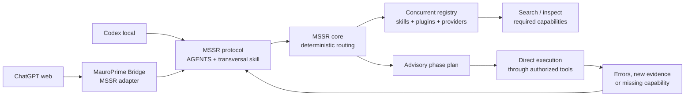

# MSSR — MauroPrime Structured Skill Router

MSSR is a portable, advisory routing layer for agents, skills, MCP tools, and
workflow phases. It is deliberately separate from MauroPrime Bridge: Bridge is
one consumer and adapter, not the owner of the routing contract.

## What it does

- turns observable request intent into a compact routing plan;
- discovers skills and capabilities from registered providers;
- selects only the skills needed for the current phase;
- preserves provenance and health in immutable registry snapshots;
- supports re-planning when a task reveals a missing or chained capability;
- exposes the same contract through a library, optional MCP facade, and a
  managed `AGENTS.md` bootstrap block.

MSSR recommends and explains. It **does not grant, revoke, proxy, or enforce
permissions**. A host agent may always inspect another available capability,
request its schema, refresh the registry, and re-plan. Host policy and tool
permissions remain authoritative.

## Architecture



Codex can use local filesystem, shell, and direct application MCPs. ChatGPT web
uses MauroPrime Bridge when it needs approved access to the same machine.
Neither route executes through MSSR: MSSR only discovers, ranks, explains, and
re-plans capabilities.

See [architecture](docs/ARCHITECTURE.md), the
[agent protocol](docs/AGENT_PROTOCOL.md), and the
[registry model](docs/REGISTRY.md).

## Install and develop

```powershell
cd C:\Dev\mssr
npm install
npm run check
npm run test:skill-routing
```

Bridge may consume this repository locally during development with a
`file:../mssr` dependency. A published package is a later distribution concern;
the source of truth is this Git repository.

## Agent bootstrap

The template at [templates/AGENTS.mssr.md](templates/AGENTS.mssr.md) is a small
transversal instruction block. Install it idempotently into a global or project
`AGENTS.md`:

```powershell
.\scripts\install-agent-bootstrap.ps1 -TargetPath C:\Users\mauro\.codex\AGENTS.md
```

It tells an agent how to classify intent, route by phase, notice friction, and
re-plan. It intentionally does not list every tool: tools are volatile runtime
capabilities and belong in the registry.

## Status

Version `0.1.0` establishes the independent repository and contract. The
roadmap documents the staged extraction and optional standalone MCP server.
