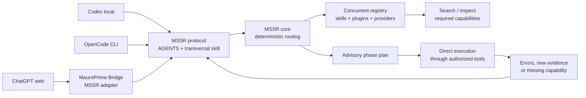

# MSSR — Modular Semantic Skill Router

MSSR is a portable, advisory routing layer for agents, skills, MCP tools, and
workflow phases. It is deliberately separate from MauroPrime Bridge: Bridge is
one consumer and adapter, not the owner of the routing contract.

## What it does

- turns observable request intent into a compact routing plan;
- discovers skills and capabilities from registered providers;
- selects only the skills needed for the current phase;
- keeps durable project facts separate from reusable global procedures;
- optionally selects modular project `context`, `memory`, `state`, and scoped `directive` sections by the same structured semantic evidence used for routing;
- preserves provenance and health in immutable registry snapshots;
- supports re-planning when a task reveals a missing or chained capability;
- supports bounded friction/outcome checkpoints that can become reviewed
  regressions, documentation, or skill/routing maintenance;
- exposes the same contract through a library, optional MCP facade, and a
  managed `AGENTS.md` bootstrap block.

MSSR recommends and explains. It **does not grant, revoke, proxy, or enforce
permissions**. A host agent may always inspect another available capability,
request its schema, refresh the registry, and re-plan. Host policy and tool
permissions remain authoritative.


A Bridge host may additionally maintain privacy-preserving trace continuity locally per session and through a bounded process-shared lease for stateless calls. It propagates a trace only when one compatible candidate is identifiable; ambiguity, restart, cross-process resume, and deliberate historical selection require an explicit `traceId`. This observability lives in the host adapter, not the deterministic core, stores no raw prompt or conversation transcript, and may expose an active measurement epoch while preserving legacy telemetry for comparison.

## Architecture



Codex can use local filesystem, shell, and direct application MCPs. OpenCode CLI
uses the portable MCP facade directly, optionally paired with a host plugin that
observes host-owned attribution. ChatGPT web uses MauroPrime Bridge when it
needs approved access to the same machine. Neither route executes through MSSR:
MSSR only discovers, ranks, explains, and re-plans capabilities.

See [architecture](docs/ARCHITECTURE.md), the
[modular project-context contract](docs/PROJECT_CONTEXT.md), the
[agent protocol](docs/AGENT_PROTOCOL.md), the
[routing evidence and observatory contract](docs/ROUTING_EVIDENCE_OBSERVATORY.md), the
[registry model](docs/REGISTRY.md), and the
[repository structure and aggregation boundaries](docs/REPOSITORY_STRUCTURE.md).

## Install and develop

```powershell
cd C:\Dev\mssr
npm install
npm run check
npm run test:skill-routing
```

Bridge may consume this repository locally during development with a
`file:../mssr` dependency. A published package is a later distribution concern;
the source of truth is this Git repository.

## Standalone MCP entrypoints

`mssr-mcp` is the portable stateless facade. It exposes capability discovery,
route planning, intent normalization, vocabulary, and trace validation/reduction;
the MCP caller supplies lifecycle state and owns persistence.

`mssr-codex-mcp` is a Codex-local adapter with an in-memory trace map. It plans
and bootstraps only locally discovered `SKILL.md` files, then records portable
lifecycle checkpoints. Neither server executes a selected capability or proxies
another MCP tool.

`mssr-opencode-mcp` is the corresponding OpenCode CLI adapter. It identifies
routes as `opencode-local`, loads active local skills, and records only explicit
checkpoints. When `MSSR_TELEMETRY_ENDPOINT` and
`MSSR_TELEMETRY_TOKEN_FILE` are configured together, it sends authenticated,
privacy-bounded events to the observability owner without proxying execution.

An optional companion plugin (`dist/opencode-plugin.js`) installs in OpenCode's
global plugin directory to observe the host-owned boundary the MCP child process
cannot see, delivering privacy-bounded `mssr-host-call-v1` attribution envelopes
to the same authenticated endpoint. Delivery is best-effort and never blocks an
OpenCode hook. See [docs/OPENCODE.md](docs/OPENCODE.md) for the OpenCode config,
plugin installation, and the `global`-project limitation.

```powershell
npm run build
npm run test:codex-standalone
npm run test:opencode-standalone
```

The standalone test uses only this package, the MCP SDK, and Codex filesystem
skill discovery; it does not require MauroPrime Bridge.

The package also exports `planCodexSkillContexts` and
`assembleCodexSkillContext`. These portable filesystem loaders materialize the
deterministic selective-context plan; hosts retain ownership of sessions,
telemetry, permissions, and delivery.

## Agent bootstrap

The template at [templates/AGENTS.mssr.md](templates/AGENTS.mssr.md) is a small
transversal instruction block. Install it idempotently into a global or project
`AGENTS.md`:

```powershell
.\scripts\install-agent-bootstrap.ps1 -TargetPath C:\Users\mauro\.codex\AGENTS.md
```

It tells an agent how to classify intent, route by phase, notice friction, and
re-plan. It intentionally does not list every tool: tools are volatile runtime
capabilities and belong in the registry.

## Status

Version `0.1.0` established the independent repository and contract; the current
release is `0.2.4` (see [CHANGELOG.md](CHANGELOG.md)). It now ships the portable
core, the standalone `mssr-mcp`, `mssr-codex-mcp`, and `mssr-opencode-mcp`
servers, and an optional OpenCode host plugin. Bridge remains a consumer adapter
rather than the owner of the routing contract.
