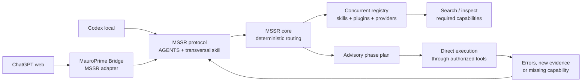

# Architecture

MSSR separates discovery and recommendation from execution.



The diagram separates the control plane from the execution plane. Codex may use
its local filesystem, shell, or direct application MCPs, while ChatGPT web uses
MauroPrime Bridge for approved access to the same machine. Both can consult the
same MSSR contract without forcing actual tool execution through MSSR or the
Bridge.

## Components

`mssr-core` is deterministic and host-neutral. Given a normalized intent,
available capabilities, routing overrides, and a phase, it returns an ordered
advisory plan and reasons.

`mssr-registry` collects providers concurrently. It publishes immutable
snapshots with provider provenance, timestamps, health, and degradation state.
Readers get the last valid snapshot while a refresh runs; a failed provider does
not erase healthy providers.

`mssr-mcp` is optional. It exposes registry and planning operations to hosts
that speak MCP, plus portable intent normalization, vocabulary, trace validation,
and trace reduction. It is stateless: callers supply lifecycle state and own its
persistence. It never executes a selected third-party tool on the agent's behalf.

The portable trace contract also evaluates closure obligations from supplied
lifecycle state. Required skills, verification, persistence, a fresh `close`
route, required maintenance, and the prospective outcome are separate explicit
gates. A successful outcome is rejected while any applicable gate remains
pending; failed, partial, and skipped outcomes remain available for truthful
closure. This pure evaluation has no knowledge of Bridge, Codex, sessions,
timers, persistence stores, or host permissions.

`mssr-codex-mcp` is the separate Codex-local adapter. It owns a process-local
trace map, invokes the same portable reducers, and may read a locally discovered
`SKILL.md` only after the route selects it. This is deliberately an adapter
boundary rather than a Bridge dependency: it does not execute selected tools,
proxy MCP calls, or make persistence part of the MSSR core.

`mssr-opencode-mcp` applies the same adapter boundary for OpenCode CLI with the
canonical caller `opencode-local`. It can deliver `mssr-telemetry-v1` envelopes
to an operator-configured authenticated sink. Envelopes contain task hashes,
bounded route metadata, skill-load results, and explicit checkpoints; they omit
task text and never synthesize success from idle time or process termination.

The optional OpenCode host plugin separately observes host-owned terminal tool
events. Its `mssr-host-call-v1` records are privacy-bounded and may include a
hashed parent session only when OpenCode explicitly emits that `parentID` in a
session lifecycle event, or when the authoritative read-only session endpoint
returns that exact session with `parentID` after an out-of-order terminal event.
It never derives a relationship from tool order, recency, agent names, or a
delegated `task` call. Failed host-call delivery is placed in a small local retry
spool; this best-effort transport is never allowed to block or alter an OpenCode
tool execution.

Adapters translate host-specific discovery and delivery to the shared contract.
MauroPrime Bridge is an adapter and transport owner, not the semantic owner of a
repository or of MSSR routing. Codex-local, OpenCode-local, Bridge, and other
hosts can therefore share portable routing metadata without being forced through
a single execution bridge.

`skill-context-loader` is the portable filesystem materializer for selected
skill context. It reads bounded `SKILL.md` and manifest sources and applies the
shared global budget plan, while host adapters continue to own session state,
telemetry, authorization, and transport.

Trace continuity is adapter-owned. `trace-contract-v1` supplies the portable
lifecycle reducers and closure rules; each host decides how it retains a trace.
Bridge currently adds bounded process-shared and persisted unique-candidate
recovery for its adapter. The native facade is stateless, while Codex-local and
OpenCode-local adapters currently retain their trace map only for the process.
No adapter may guess across multiple candidates: ambiguity requires an explicit
ID. Measurement epochs and active/all-history filtering are likewise host
observability concerns, not routing inputs.

The telemetry transport is optional and separate from routing. A host adapter
may report a validated lifecycle to an observability owner, but delivery failure
does not change permissions or make a route an execution proxy. The receiver
must authenticate, validate, bound, deduplicate, and persist each event.

## Reasoning-to-routing boundary

The current model or agent produces a bounded Routing Evidence Checkpoint after interpreting the visible request. MSSR receives that observable classification, not private chain-of-thought. The host activation hook is therefore part of the control plane: without the tool call or equivalent structured action, the deterministic router cannot observe the task.

Host adapters may also deliver a bounded context-notice inbox. Runtime errors, provider drift, concurrent agents, pending reviews, changed project state, or missing routing compliance become new evidence for context retrieval or replanning. Notices carry information; they do not grant authorization.

Outcome observability follows the same boundary. One primary skill owns the latest outcome on a task trace, supporting skills remain visible as contributors, and objective evidence determines success or acceptance where available. This prevents one task from being counted as several successes merely because several skills collaborated.

## MSSR Context Plane v1

The Context Plane is the portable contract for selecting, carrying, and
accounting for bounded context messages. It is distinct from both the routing
control plane and host execution:

```text
repository-owned facts + runtime/Git/trace evidence
                 -> adapter/provider reads and delivery
                 -> portable MSSR selection, continuity, and message contract
                 -> host inbox or next-result piggyback
                 -> agent reviews evidence and performs only separately authorized work
```

MSSR owns the portable selection dimensions, message/receipt semantics,
continuation identity, provenance/freshness requirements, and the rule that a
message is evidence rather than authorization. Repositories own the meaning and
truth of their project documents, ADRs, changelogs, incidents, and current
state. Providers and adapters own I/O, authentication, delivery timing, runtime
readback, and local retention. Bridge may assemble or deliver a message but does
not become the semantic owner of its contents.

A Context Plane message is a bounded, typed reference to evidence or a request
to obtain it. It may be delivered in a pull inbox or piggybacked on a normal
tool response because an MCP server cannot assume a client will turn a push into
a model turn. It contains no capability grant: a recipient must still verify
the source, select the proper owner tool, and obey normal user authorization,
approvals, permissions, and safety policy.

The staged v1 contract covers messages from project authorities, ADRs,
changelogs, incidents, Git/runtime evidence, provider state, and a compatible
task trace. A continuation receives a compact receipt of already selected
sources, their provenance/freshness, unresolved evidence, and the next gate;
it does not receive a raw transcript or a claim that stale evidence is current.
Durable persistence is a reviewable proposal directed to the repository or
other canonical owner. Telemetry may record bounded receipts and evidence
references, but it must not silently write project facts, routing metadata,
skills, or release history. See [ADR 0001](decisions/0001-context-plane-v1.md).

### Phase 2 portable implementation

Phase 2 adds the portable, host-neutral core behind those semantics as
pure modules. It does not yet wire any host adapter to drain them:

- Strict producers (`src/context-message-producers.ts`) convert bounded
  observations about architecture decisions, incidents, changelogs, project
  authorities, Git, and providers into Context Messages with deterministic
  dedupe keys derived from `sourceKind:canonicalOwner:ref`. Unavailable
  surveys are `unavailable`, authoritative available reads are `fresh`, and a
  receipt alone stays `unknown` rather than pretending to prove freshness.
- The repository collector (`src/context-message-repository-provider.ts`)
  scans canonical repository facts (ADRs, `docs/INCIDENTS.md`, root and newest
  versioned changelogs, canonical `.bridge`/`docs` PROJECT_* authorities) and
  merges caller-supplied Git/provider receipts. Reads are bounded and report
  diagnostics/overflow without exposing file bodies.
- Freshness revalidation (`src/context-message-freshness.ts`) compares stored
  evidence against a bounded current observation and always resolves to
  `fresh`, `stale`, `conflicting`, `unavailable`, or `unknown`.
- The durable explicit-ack JSON inbox (`src/context-message-inbox.ts`) keeps a
  schema-versioned `advisoryOnly` state with strict enqueue/select/
  acknowledge/prune actions, bounded delivery receipts, TTL pruning, and
  atomic file persistence. Receipts prove delivery, not authorization, and no
  action auto-executes a persistence proposal.

Host delivery remains adapter-owned and is still pending for phase 2: the
native facade, Codex-local, OpenCode-local, and Bridge adapters have not yet
been wired to drain the inbox or piggyback its messages.


## Durable project context layer

MSSR does not own a project's facts or full history. Each repository owns its architecture, vocabulary, canonical paths, durable decisions, current state, blockers, and local evidence. The portable core defines how a host may select that material; the repository remains the source of truth.

A project may publish `.bridge/project-context.json` with two layers:

- `core`: a deliberately small set of `context`, `memory`, or `state` sections needed before or alongside intent classification;
- `modules`: optional or required `context`, `memory`, `state`, or scoped `directive` sections selected by the current `stage`, `domains`, `actions`, `artifacts`, `needs`, and `signals`.

Project-module selection and skill-module selection reuse the same deterministic semantic selection primitive, but they are independent retrieval axes:

```text
project context retrieval -> what is true here + which local refinement applies now
MSSR skill routing        -> which reusable procedure is needed now
```

`AGENTS.md` remains the repository-level instruction authority. A project `directive` is only a scoped refinement for a matching intent/stage; it cannot weaken user instructions, host policy, approvals, permissions, AGENTS, or verification. Broad permanent rules belong in AGENTS, while cross-project procedures belong in skills.

Before canonical intent is available, a host may load only the project core. After intent exists, it selects bounded project modules and the active skill modules. At meaningful stage changes such as verify, persist, close, resume, or a material replan, both sets may be selected again. Hosts without a modular manifest may preserve an observable legacy full-document fallback during migration.

See `PROJECT_CONTEXT.md` for the manifest and memory-maintenance contract.

## Observability and learning boundary

Route plans, skill loads, replans, verification, persistence, outcomes, context
sources, and friction checkpoints may be recorded as privacy-preserving structured
telemetry. The telemetry can reveal missed activations, unused required skills,
repeated workarounds, or phase failures, but it cannot silently rewrite routing or
skills. Confirmed patterns are promoted through explicit maintenance tasks and
regression fixtures.

## Invariants

1. Routing is recommendation, not authorization.
2. Providers are independent; failure is localized and visible.
3. A plan is phase-scoped and can be re-planned at any point.
4. Registry data is dynamic; agent protocol is stable and compact.
5. Skill source repositories remain Git-owned; runtime installations may be
   junctions or host-managed copies.
