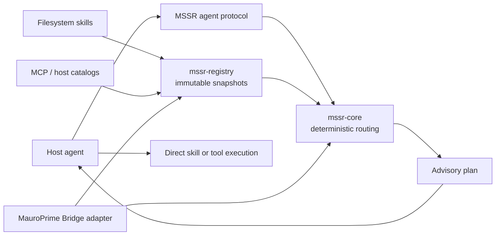

# Architecture

MSSR separates discovery and recommendation from execution.

## Components

`mssr-core` is deterministic and host-neutral. Given a normalized intent,
available capabilities, routing overrides, and a phase, it returns an ordered
advisory plan and reasons.

`mssr-registry` collects providers concurrently. It publishes immutable
snapshots with provider provenance, timestamps, health, and degradation state.
Readers get the last valid snapshot while a refresh runs; a failed provider does
not erase healthy providers.

`mssr-mcp` is optional. It exposes registry and planning operations to hosts
that speak MCP. It never executes a selected third-party tool on the agent's
behalf.

Adapters translate host-specific discovery to the shared contract. MauroPrime
Bridge, Roblox Studio, Codex-local, and a web client can therefore share routing
metadata without being forced through a single execution bridge.

## Invariants

1. Routing is recommendation, not authorization.
2. Providers are independent; failure is localized and visible.
3. A plan is phase-scoped and can be re-planned at any point.
4. Registry data is dynamic; agent protocol is stable and compact.
5. Skill source repositories remain Git-owned; runtime installations may be
   junctions or host-managed copies.

