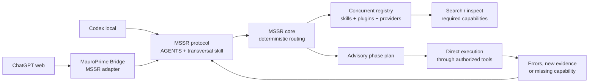

# Architecture

MSSR separates discovery and recommendation from execution.



The diagram separates the control plane from the execution plane. Codex may use
its local filesystem, shell, or direct application MCPs, while ChatGPT web uses
MauroPrime Bridge for approved access to the same machine. Both can consult the
same MSSR contract without forcing actual tool execution through MSSR or the
Bridge.

## Components

`mssr-core` is deterministic and host-neutral. Given a normalized intent,
available capabilities, routing overrides, and a phase, it returns an ordered
advisory plan and reasons.

`mssr-registry` collects providers concurrently. It publishes immutable
snapshots with provider provenance, timestamps, health, and degradation state.
Readers get the last valid snapshot while a refresh runs; a failed provider does
not erase healthy providers.

`mssr-mcp` is optional. It exposes registry and planning operations to hosts
that speak MCP. It never executes a selected third-party tool on the agent's
behalf.

Adapters translate host-specific discovery to the shared contract. MauroPrime
Bridge, Roblox Studio, Codex-local, and a web client can therefore share routing
metadata without being forced through a single execution bridge.

Trace continuity is adapter-owned. `trace-contract-v1` keeps local session state and a bounded process-shared lease so stateless calls can recover exactly one compatible trace by observable task, caller, or skill metadata. It never guesses across multiple candidates: ambiguity requires an explicit ID. The adapter propagates through direct calls and generic dispatch wrappers, closes on outcome, and emits notices when required loads or boundaries disagree. The core remains stateless. Measurement epochs and active/all-history filtering are likewise host observability concerns, not routing inputs.

## Reasoning-to-routing boundary

The current model or agent produces a bounded Routing Evidence Checkpoint after interpreting the visible request. MSSR receives that observable classification, not private chain-of-thought. The host activation hook is therefore part of the control plane: without the tool call or equivalent structured action, the deterministic router cannot observe the task.

Host adapters may also deliver a bounded context-notice inbox. Runtime errors, provider drift, concurrent agents, pending reviews, changed project state, or missing routing compliance become new evidence for context retrieval or replanning. Notices carry information; they do not grant authorization.

Outcome observability follows the same boundary. One primary skill owns the latest outcome on a task trace, supporting skills remain visible as contributors, and objective evidence determines success or acceptance where available. This prevents one task from being counted as several successes merely because several skills collaborated.


## Durable project context layer

MSSR does not own a project's facts or full history. Each repository owns its
architecture, vocabulary, canonical paths, current state, open blockers, and
local incident evidence through durable project files. A host first resolves the
smallest relevant project context, then sends a bounded summary with the current
intent to MSSR.

This creates two independent retrieval axes:

```text
project context retrieval -> what is true here
MSSR routing             -> which reusable procedure is needed now
```

The host may therefore keep hundreds of available skills without injecting their
contents. Registry metadata remains searchable, while only the active phase's
procedures are loaded. Historical project evidence is referenced or summarized,
not copied wholesale into the route.

## Observability and learning boundary

Route plans, skill loads, replans, verification, persistence, outcomes, context
sources, and friction checkpoints may be recorded as privacy-preserving structured
telemetry. The telemetry can reveal missed activations, unused required skills,
repeated workarounds, or phase failures, but it cannot silently rewrite routing or
skills. Confirmed patterns are promoted through explicit maintenance tasks and
regression fixtures.

## Invariants

1. Routing is recommendation, not authorization.
2. Providers are independent; failure is localized and visible.
3. A plan is phase-scoped and can be re-planned at any point.
4. Registry data is dynamic; agent protocol is stable and compact.
5. Skill source repositories remain Git-owned; runtime installations may be
   junctions or host-managed copies.
